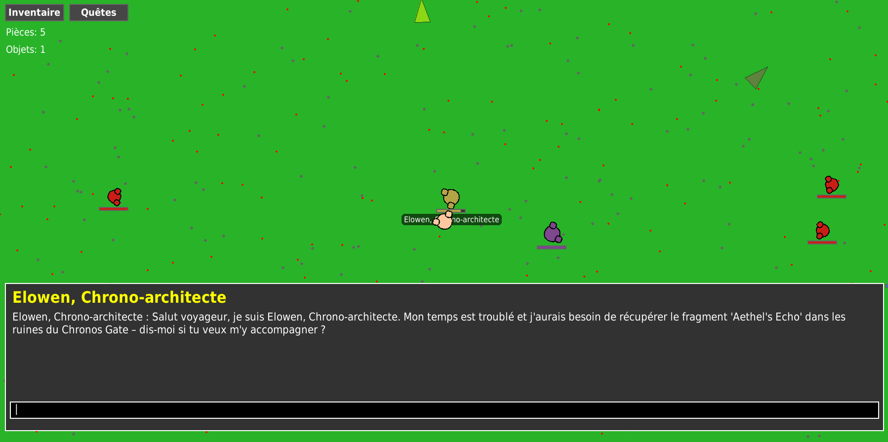

# Local AI RPG

A 2D open-world RPG where **all AI runs locally on your machine**. No internet required. Talk freely with NPCs, get AI-generated quests, and explore a world where goals are created dynamically.



## Features

- AI-generated conversations with any NPC
- Dynamic quest system (fetch quests + rewards)
- Open world exploration
- Enemies and combat
- Runs on GTX 1650 and up

## Quick Start

### 1. Install Dependencies
```bash
sudo apt update
sudo apt install -y build-essential cmake python3.12-dev libomp-dev libopenblas-dev

python3 -m venv venv
source venv/bin/activate
pip install --upgrade pip setuptools wheel
```

### 2. Install llama-cpp-python

**With NVIDIA GPU** (recommended):
```bash
CMAKE_ARGS="-DGGML_CUDA=1 -DCMAKE_CUDA_COMPILER=/usr/local/cuda/bin/nvcc -DCMAKE_CUDA_ARCHITECTURES=75" \
pip install llama-cpp-python --force-reinstall --no-cache-dir
```

**Note**: Change `75` to your GPU architecture ([find yours here](https://developer.nvidia.com/cuda-gpus)). Need CUDA drivers? [Install guide](https://docs.nvidia.com/cuda/cuda-installation-guide-linux/)

**CPU only** (slower):
```bash
pip install llama-cpp-python
```

### 3. Install Pygame
```bash
pip install pygame
```

### 4. Download AI Model
```bash
mkdir -p models
wget https://huggingface.co/LiquidAI/LFM2-2.6B-GGUF/resolve/main/LFM2-2.6B-Q4_0.gguf -P models/
```

Or download manually from [HuggingFace](https://huggingface.co/LiquidAI/LFM2-2.6B-GGUF) and put in `models/` folder.

### 5. Run
```bash
source venv/bin/activate
python3 main.py
```

## AI Model

I used **LFM2 2.6B** (quantized to 4-bit, ~1.5GB) because it runs fast on a GTX 1650, enabling smooth real-time AI interactions. It delivers good conversation quality, generating coherent and context-aware dialogue.

There are still huge limitations due to its size, but if desired, the model can be upgraded to a larger version for more advanced conversations and better understanding at the cost of higher VRAM and slower performance.


## Current Status

The game is still in development, and I plan to add these features soon:
- ⏳ Combat system coming soon
- ⏳ More types of quests, including dynamic and multi-step objectives
- ⏳ Loot system with random drops and lootboxes
- ⏳ Possibility to buy items directly from NPCs
- ⏳ Random events appearing dynamically in the world
