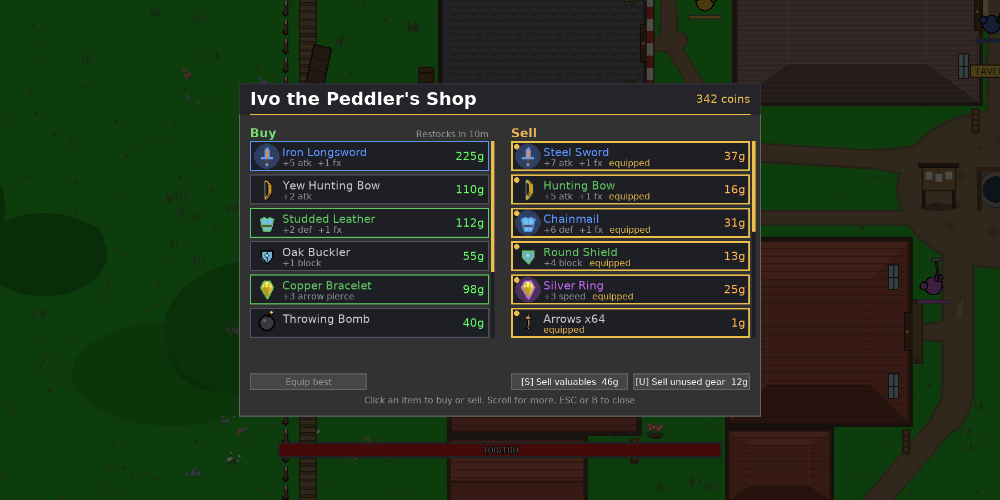

<div align="center">

# Local AI RPG

**A 2D open world RPG where every line of dialogue is written by an LLM running on your own GPU.**

Talk to anyone in your own words. Quests come out of the conversation. Nothing leaves your machine.


</div>

## What there is to do

- Conversations with villagers using a local LLM
- NPCs can give quests
- Full combat system
- Loot with rarities and stats evolution
- An endless generated world

## A few parts of the game

<table>
<tr>
<td width="50%"></td>
<td width="50%"></td>
</tr>
<tr>
<td width="50%"></td>
<td width="50%"></td>
</tr>
<tr>
<td width="50%"></td>
<td width="50%"></td>
</tr>
</table>

## Play it

The game with the AI on, which is the way it is meant to be played: villagers answer what
you actually type, and quests are written out of the conversation. It needs Linux, an NVIDIA
GPU with 4GB of VRAM or more (a GTX 1650 is enough), and CUDA drivers. Setup is five steps
and takes about ten minutes, most of it a compile and a download.

**1. The repo**

`uv` is the Python package manager this uses, and it installs its own Python:
`curl -LsSf https://astral.sh/uv/install.sh | sh`.

```bash
git clone https://github.com/vcherel/local-ai-rpg.git
cd local-ai-rpg
uv sync
```

**2. System packages**

A compiler and the maths libraries, needed to build the piece that runs the model.

```bash
sudo apt update
sudo apt install -y build-essential cmake python3.12-dev libomp-dev libopenblas-dev
```

**3. llama-cpp-python, built for your GPU**

This is what runs the model. The version on PyPI is CPU only and fails quietly, slow and
never touching the card, so it is compiled here instead, which takes a few minutes.
`native` is whichever card is in this machine; a CUDA older than 11.5 does not know the
word, and `uv run doctor` prints the number to put there instead.

```bash
CMAKE_ARGS="-DGGML_CUDA=1 -DCMAKE_CUDA_COMPILER=/usr/local/cuda/bin/nvcc -DCMAKE_CUDA_ARCHITECTURES=native" \
uv pip install llama-cpp-python --force-reinstall --no-cache-dir
```

**4. The model** (~2.9GB)

The weights themselves, one file, downloaded into `models/`.

```bash
uv run fetch-model
```

**5. Check it**

Says what this machine has, and the exact command for whatever is missing. The failures
worth catching are a build that never reaches the GPU, a model too big for the VRAM and a
build compiled for another card: the first looks like the game simply being slow, and the
last two look like nothing at all until the game asks for a line. So the last check loads
the weights and asks for one token, which is why it takes a moment.

```bash
uv run doctor
```

```
[  ok  ] GPU: NVIDIA GeForce GTX 1650, 4096 MiB
[  ok  ] llama-cpp-python: 0.3.31, GPU offload available
[  ok  ] Model: models/Qwen2.5-7B-Instruct-Q2_K.gguf, 2.8GB
```

Then play:

```bash
uv run game
```

The title screen says whether the model is loaded.

## Play it without the AI

No GPU, no CUDA, Windows or a Mac: the game runs anywhere Python does, and it is the whole
game with the AI turned off. Villagers speak from a written bank of lines and quests come off
the notice boards. Everything else, the world, the fighting, the loot, is the real thing.
Skip every step above but the first, and run it:

```bash
git clone https://github.com/vcherel/local-ai-rpg.git
cd local-ai-rpg
uv sync
uv run game
```

## The model

**Qwen2.5-7B-Instruct**, quantized to Q2_K (~2.9GB), chosen so the whole thing fits in a
GTX 1650's 4GB of VRAM. Swap in a bigger model or a higher quant by dropping another GGUF in `models/`, at the cost
of VRAM and speed.

## Working on it

There is no test suite. A change is checked by running the world headless instead: `scripts/verify/`
stands a real game up on SDL's dummy drivers with the model stubbed and a virtual clock, so
nothing here opens a window or needs a GPU.

```bash
uv run python scripts/verify/refs.py         # every module parses, every self.x() resolves
uv run python scripts/verify/smoke.py        # 900 frames, then look at what the world is left as
uv run python scripts/verify/render_diff.py  # this tree against HEAD, pixel by pixel
```

The first two run on every push. `scripts/verify/README.md` says what the rest are for and
what makes a run reproducible.

## License

MIT.
