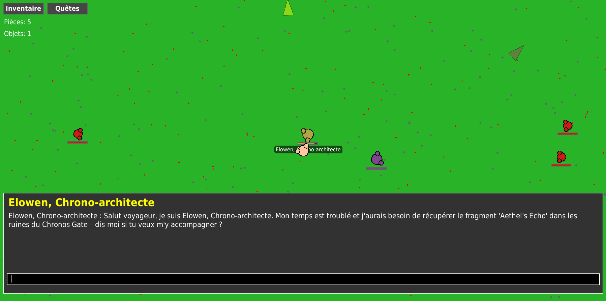

# Local AI RPG

A 2D open-world RPG where **all AI runs locally on your machine**. No internet required. Talk freely with NPCs, get AI-generated quests, and explore a world where goals are created dynamically.



## Features

**AI**
- AI-generated conversations with any NPC, with an affinity system that tracks how each NPC feels about you and shifts dialogue tone, quest rewards, and shop prices
- Dynamic quest system: fetch, kill, loot drop, recover stolen item, and slay boss quests, all generated from conversation
- The world's lore, its settlement and landmark names, its bosses and its shop stock are all written by the model at run time

**World**
- Endless world: points of interest, villages and terrain stream in per chunk as you walk, so there is no edge to hit
- Villages of houses, shops and taverns you can walk inside, with breakable crates, windows, barrels and chests
- Wilderness landmarks: ruins to loot, shrines to find, bandit camps to clear and traveller camps to trade at and rest by
- Day/night cycle, random world events (wandering merchants, treasure, rumors, blood nights, village crises) and a minimap that only remembers ground you have actually walked

**Combat and progression**
- Melee and ranged combat side by side: weapon families (dagger, sword, axe, hammer, spear, staff, bow) each with their own reach, cadence and weight, plus arrows, crits, knockback and cleave
- Named multi-phase bosses with telegraphed abilities and an enrage phase
- Loot with rarity tiers, rolled affixes (lifesteal, burn, thorns, execute and legendary-only signature effects), potions and timed buffs
- Use-based character progression: the stats you lean on are the ones that level
- Huntable wildlife, shops to buy and sell in, and a death penalty you recover from rather than reload around

**Technical**
- Sound effects and visual hit feedback (hit-stop, screen shake, blood decals, floating damage)
- Save and continue your game
- Runs on GTX 1650 and up

## Quick Start

### 1. Install system dependencies
```bash
sudo apt update
sudo apt install -y build-essential cmake python3.12-dev libomp-dev libopenblas-dev
```

### 2. Install uv (if not already installed)
```bash
curl -LsSf https://astral.sh/uv/install.sh | sh
```

### 3. Install llama-cpp-python

**With NVIDIA GPU** (recommended):
```bash
CMAKE_ARGS="-DGGML_CUDA=1 -DCMAKE_CUDA_COMPILER=/usr/local/cuda/bin/nvcc -DCMAKE_CUDA_ARCHITECTURES=75" \
uv pip install llama-cpp-python --force-reinstall --no-cache-dir
```

**Note**: Change `75` to your GPU architecture ([find yours here](https://developer.nvidia.com/cuda-gpus)). Need CUDA drivers? [Install guide](https://docs.nvidia.com/cuda/cuda-installation-guide-linux/)

**CPU only** (slower):
```bash
uv pip install llama-cpp-python
```

### 4. Install dependencies
```bash
uv sync
```

### 5. Download AI Model
```bash
mkdir -p models
wget https://huggingface.co/bartowski/Qwen2.5-7B-Instruct-GGUF/resolve/main/Qwen2.5-7B-Instruct-Q2_K.gguf -P models/
```

Or download manually from [HuggingFace](https://huggingface.co/bartowski/Qwen2.5-7B-Instruct-GGUF) and put in `models/` folder.

### 6. Run
```bash
uv run game
```

## AI Model

I used **Qwen2.5-7B-Instruct** (quantized to Q2_K, ~2.9GB) for noticeably better dialogue than the smaller 3B model, while still fitting fully in the GTX 1650's 4GB VRAM for full-speed GPU inference. A larger model at a higher quant (e.g. Q4_K_M) gave better quality per token but didn't fit in 4GB VRAM; running it with some layers offloaded to CPU worked but was too slow in practice, so this Q2_K quant is the sweet spot of fitting entirely on the GPU while still packing more parameters than the original 3B model. It uses the same ChatML prompt format as before, so it's a drop-in swap.

If desired, the model can be upgraded further (bigger model or higher quant) at the cost of VRAM and speed, most likely requiring partial CPU offload again.
