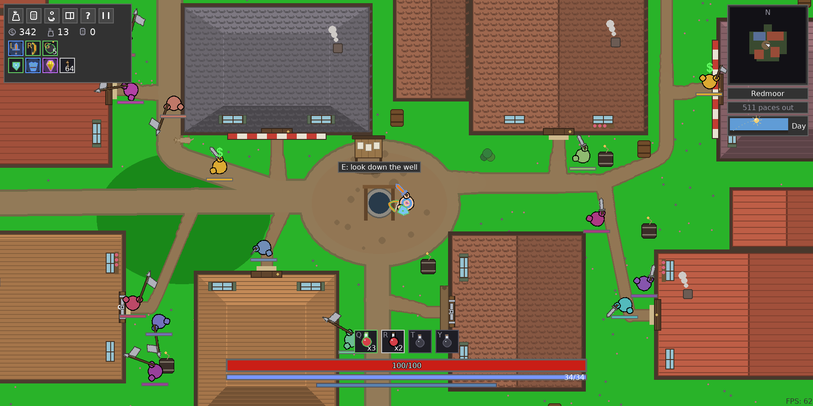
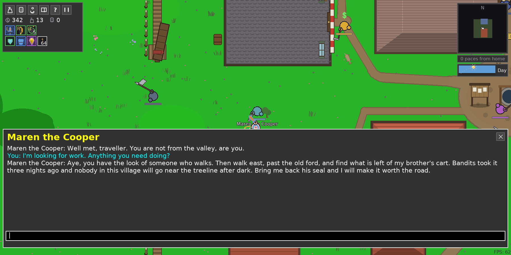
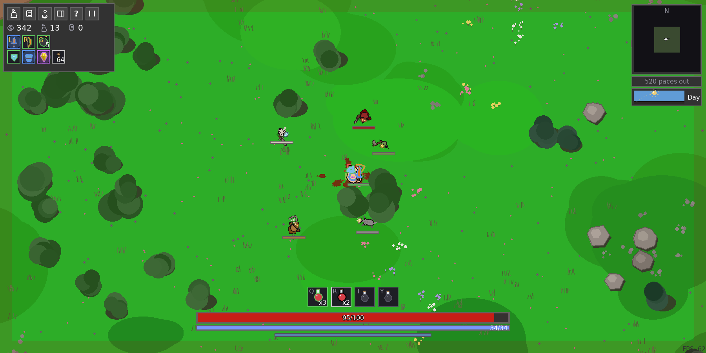
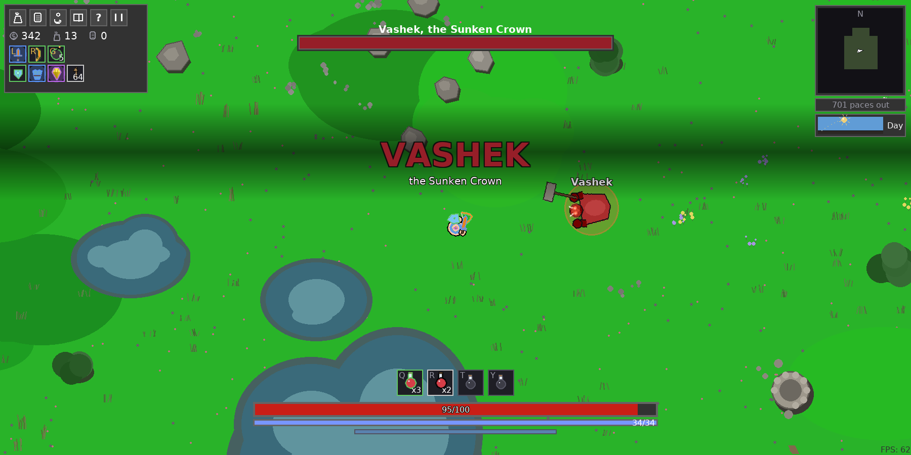
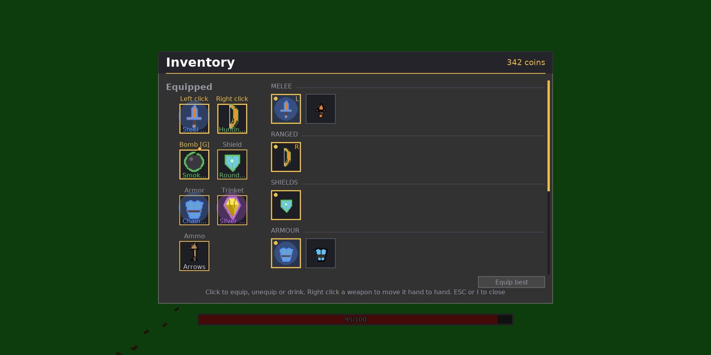
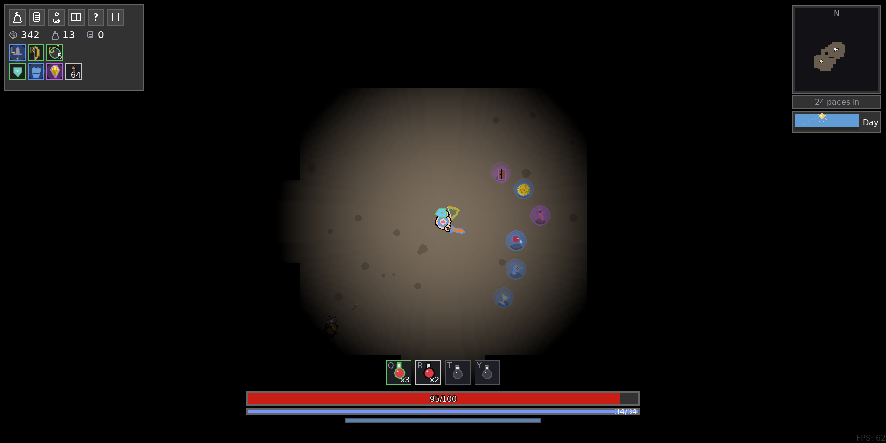

<div align="center">

# Local AI RPG

**A 2D open world RPG where every line of dialogue is written by an LLM running on your own GPU.**

Talk to anyone in your own words. Quests come out of the conversation. Nothing leaves your machine.




</div>

## Talk your way into a quest

Walk up to anyone, press **E**, and type whatever you want. The model plays the villager,
and what you agree on becomes a real tracked quest with a real target and a real reward.



<table>
<tr>
<td width="50%"></td>
<td width="50%"></td>
</tr>
<tr>
<td align="center"><b>Two hands, one weapon in each</b></td>
<td align="center"><b>Named bosses that climb out of the ground</b></td>
</tr>
<tr>
<td width="50%"></td>
<td width="50%"></td>
</tr>
<tr>
<td align="center"><b>Loot with rarities and rolled affixes</b></td>
<td align="center"><b>Caves lit only as far as you can walk</b></td>
</tr>
</table>

## Install

You need an NVIDIA GPU with 4GB of VRAM or more (a GTX 1650 is enough), CUDA drivers, and
Linux. Five steps, about ten minutes, most of it the model download.

**1. System packages**

```bash
sudo apt update
sudo apt install -y build-essential cmake python3.12-dev libomp-dev libopenblas-dev
```

**2. uv**

```bash
curl -LsSf https://astral.sh/uv/install.sh | sh
```

**3. The repo and its dependencies**

```bash
git clone https://github.com/vcherel/local-ai-rpg.git
cd local-ai-rpg
uv sync
```

**4. llama-cpp-python, built for your GPU**

The wheel on PyPI is CPU only, so it has to be rebuilt. Replace `75` with your card's
[compute capability](https://developer.nvidia.com/cuda-gpus) (75 is Turing: GTX 1650, RTX 20xx).

```bash
CMAKE_ARGS="-DGGML_CUDA=1 -DCMAKE_CUDA_COMPILER=/usr/local/cuda/bin/nvcc -DCMAKE_CUDA_ARCHITECTURES=75" \
uv pip install llama-cpp-python --force-reinstall --no-cache-dir
```

<details>
<summary>No GPU? (much slower, but it runs)</summary>

```bash
uv pip install llama-cpp-python
```

</details>

**5. The model** (~2.9GB)

```bash
mkdir -p models
wget https://huggingface.co/bartowski/Qwen2.5-7B-Instruct-GGUF/resolve/main/Qwen2.5-7B-Instruct-Q2_K.gguf -P models/
```

**Play**

```bash
uv run game
```

## What is in it

<details open>
<summary><b>AI</b></summary>

- Free text conversation with any NPC, with an affinity system that shifts their tone, their prices and what they will pay you
- Eight quest types built out of what you actually talked about: fetch, kill, loot, recover, clear a camp, steal, deliver, slay a boss
- The world's lore, its settlement names, its bosses and its shop stock are all written by the model at run time
- Every call is serialised onto one background thread, so the frame never waits on the model

</details>

<details>
<summary><b>World</b></summary>

- Endless and deterministic: terrain, landmarks and villages stream in per chunk as you walk, and there is no edge to hit
- Villages of houses, shops and taverns you can walk inside, laid out round a plaza with lanes that join the roads outside
- Wilderness landmarks: ruins, shrines, bandit camps, farmsteads, graveyards, watchtowers
- Tunnels and caves under the map, reached by a village well or a cave mouth, lit only as far as the floor you can reach
- Day and night, weather that shortens sight instead of filtering the screen, and random events: wandering merchants, treasure, rumours, blood nights
- A minimap that draws memory rather than radar: only ground you have walked

</details>

<details>
<summary><b>Living in the world</b></summary>

- Villages warn you before they turn, once per kind of offence, each with its own wording and its own visible countdown
- Turn one anyway and you can buy it back, at a blood price read off how big the place is and how long its grudge has run
- Word travels: a deed fades with distance and time, and costs you a rung of warning and a surcharge at every shelf within earshot
- Blood nights send a raid at the nearest settlement, and helping fight one off is the only thing that lifts a whole village's opinion at once
- Notice boards in the plaza hand out quests without spending a model call

</details>

<details>
<summary><b>Combat and progression</b></summary>

- Two hands, one weapon in each: left button, right button, and a key to swap them over
- Weapon families with their own reach, cadence and weight: dagger, sword, axe, hammer, spear, staff, bow
- A shield worn on the offhand side, where the wedge it shows is the wedge that actually turns a blow
- Bombs in a slot of their own: a mine laid on the ground, a grenade thrown at the cursor
- Named multi phase bosses that climb out of the ground, with telegraphed abilities and an enrage phase
- Loot rarities, rolled affixes (lifesteal, burn, thorns, execute), potions and timed buffs
- Use based progression: the stats you lean on are the ones that level
- Death scatters some of what you carried where you fell, and you walk back for it

</details>

<details>
<summary><b>Presentation</b></summary>

- Procedural sound effects and a chord pad score that answers what is happening around you
- Hit stop, screen shake, blood decals drawn from the weapon that made the wound, floating damage numbers
- Everything drawn as vector art, no sprite sheets

</details>

## The model

**Qwen2.5-7B-Instruct**, quantized to Q2_K (~2.9GB), chosen so the whole thing fits in a
GTX 1650's 4GB of VRAM. Full offload is the only criterion that matters: a higher quant
writes better dialogue per token, but it does not fit, and running it with some layers on
the CPU is too slow to hold a conversation with. Within what fits, more parameters at a
lower quant beat fewer at a higher one.

Swap in a bigger model or a higher quant by dropping another GGUF in `models/`, at the cost
of VRAM and speed.

## Under the hood

`docs/design/` explains why each system works the way it does, one file per subject.
`scripts/verify/` is how a change is checked: a real game booted headless on SDL's dummy
drivers with the model stubbed and a virtual clock, so a run is a function of its seed and
two runs give byte identical frames. Every screenshot on this page came out of that harness.

## License

MIT.
